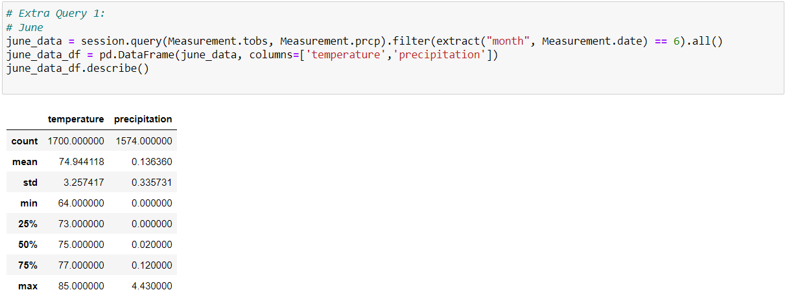

#### Challenge 9: Module 9

# Overview of Project

## Purpose of Surfs_up Analysis

The next challenge consisted in the creation of some queries to determine the weather conditions during June and December. During module 9, W. Avy required other queries that helped him to see if his project of a surf and ice cream shop could be successful focusing on the weather. The required information obtained with the June and December queries will help to visualize the weather in those months and their differences, giving the answer of his main question: Is the business sustainable year-round in Oahu? 
The tools needed to complete the challenge were Python, Pandas functions and methods, and SQLAlchemy. 

# Results

## Summary Statistics for June

The first query created was for the month of June. Image 1. shows the summary statistics for June, where it can be seen several points. 
* The mean temperature in June is 75 degrees. 
* The number of temperatures obtained is 1700, the sample.
* The range of temperature is between 64 and 85 degrees.

###### Image 1. Summary Statistics for June.

## Summary Statistics for December

The other query consisted in replicating the same code just changing the month. The results can be seen in Image 2. and there are some specific points to focus on.
* The mean temperature in June is 71 degrees. 
* The number of temperatures obtained is 1517, the sample.
* The range of temperature is between 56  and 83 degrees.
 
###### Image 2. Summary Statistics for December.

* The comparison of both summary tables shows that the results didn’t change drastically. The number of temperatures obtained in June is minimally higher than the number in December, making the other results change. 
* The change of temperature between June and December is minimum and both have their maximum value of temperature inside a common range of temperature. 
* The mean also shows that the temperature in most of the days, from both months, is adequate. 

# Summary

The conclusion of the results tell W. Avy that the conditions in Oahu are optimized for that  type of business. It could be seen that the temperature during both months didn’t change notoriously, so it could be concluded that the temperature most of the year is similar to both months. Other two extra queries were created to visualize the results and confirm the general conclusion.

## Additional Query 1:

The extra query was created to visualize and compare the temperature with the precipitation and see if there is a relation between them. The code of the query for June is located in Image 3. with the final results.

###### Image 3. Additional Query 1 for June.

The same query was created for December and it is shown in Image 4. 

###### Image 4. Additional Query 1 for December.

* Analyzing both tables, the relation between the temperature and the precipitation is that the precipitation increases when the temperature increases. The most notorious example is in December, having 0 precipitation at its minimum temperature and increasing according to the increase of percentage and increase of temperature.
* The percentage of precipitations is quite minimum, those results confirm the conclusion of being Oahu a great place to locate the business. 

## Additional Query 2:

The other extra query added consists in having the minimum, maximum and average temperature from June and December. The results are the same as the other table, but the results are easy to visualize and can be used for specific comparisons, with other months or between years. Image 5. shows the code of the query for June and December and their results.

###### Image 5. Additional Query 2.

One recommendation for the next analysis could consist of creating more plots to visualize the results in a better way and create more queries to find new relations between the results. Another tip could be to analyze each year and see if there is an increase or decrease of temperature according to the other years. 

